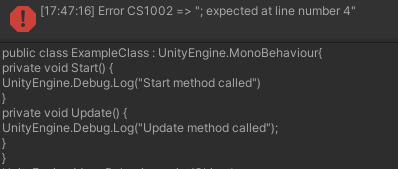

  

     

  <b>Code Graph</b> is an open-source <b>visual programming</b> tool for artists, designers and other non-programmers alike who want to make games but don't know how to program. Code Graph is similar in functionality to the Shader Graph addon by Unity.

# TODO (Last edited 27/01/2020 at 15:12)
## Frontend
~~- [ ] Implement a basic UI using the in-game UI elements~~
- [ ] Implement UI using a custom EditorWindow
## Backend
- [x] Add a way to remove connection between nodes
- [x] Add a way to have multiple connections from one Output node to Input nodes
- [ ] Provide error checking in a more useful way (aka don't tell the user that a ; is missing on line #xxxx when the user doesn't even look at the code generated)

# Progress so far
- Basic fundamental nodes defined on the backend
- Able to generate code, compile said code and check for errors

**Example of generated code from nodes and error given**

