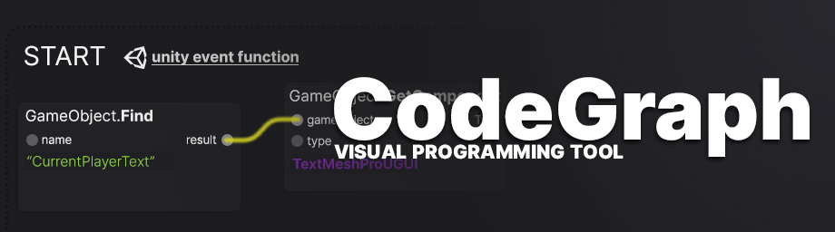

<p align="center">
  
</p>
<p align="center">
<a href="https://github.com/TeodorVecerdi/CodeGraph/issues"></a> <a href="https://www.codacy.com/manual/TeodorVecerdi/CodeGraph?utm_source=github.com&amp;utm_medium=referral&amp;utm_content=TeodorVecerdi/CodeGraph&amp;utm_campaign=Badge_Grade"></a> <a href="https://github.com/TeodorVecerdi/CodeGraph/releases/latest"></a> <a href="https://github.com/TeodorVecerdi/CodeGraph/stargazers"></a> <a href="https://github.com/TeodorVecerdi/CodeGraph/graphs/contributors"></a> <a href="https://github.com/TeodorVecerdi/CodeGraph/blob/master/LICENSE"></a>
</p>

**CodeGraph is no longer maintained. Consider using another solution such as [Bolt/Unity Visual Scripting](https://unity.com/products/unity-visual-scripting).**

# CodeGraph

<p align="justify">
  <b>CodeGraph</b> is an open-source <b>visual programming</b> tool for artists, designers and other non-programmers alike who want to make games but don't know how to program. It's based on Unity's new UIElements library and GraphView, the same library Shader Graph is built on.
</p>

# Getting started
## Prerequisites
CodeGraph was built using Unity 2019.3.x, but any other version that supports UIElements should work perfectly with CodeGraph. CodeGraph doesn't have any dependencies besides `Newtonsoft.JSON` which comes inside the `.unitypackage` file.

## Installing
Download the version you would like to use from the [Releases](https://github.com/TeodorVecerdi/CodeGraph/releases) page. (Download the .unitypackage file)  
Afterwards just open the .unitypackage file in Unity and enjoy.

## Usage
After importing the CodeGraph Unity Package, you can start using CodeGraph by right clicking in your assets folder (from Unity) and creating a New CodeGraph MonoBehaviour. Double clicking this file will open the CodeGraph Editor where you can start adding nodes and connections. After creating your graph you can convert it into C# code (the default programming language used in Unity) by clicking the "Compile graph" button at the top of the window. Next to that button is the "Save graph" button which saves the current state.  
**DISCLAIMER: CodeGraph doesn't save automatically and it doesn't alert you of unsaved changes when you try to close the window, open a different file, etc. so make sure you save your file regularly by either clicking the save button or hitting CTRL-S on your keyboard**  
Clicking the Compile button will produce a C# file in the same directory with the same name. You should use this file or attach it to gameobjects, as there is no way *yet* to use CodeGraph files directly in your game.  
For more information about how to use CodeGraph and what nodes are available check the Examples folder provided.

### How to get started with CodeGraph
CodeGraph works mainly with Unity events such as Start, Awake and Update. Everytime you add one of these nodes to your graph they will be added to the compiled C# file. You also have the option to add your own functions and call them later. Any event node (and the Create Method node) have a button attached to them called "Add new port" this will add a new port to the output of the node which can be used to connect to other nodes. When generating the code each of the ports will be added to the code in the order they appear on the Event node.  
For example, take the following CodeGraph:  
  
It contains a Start Event node, two Print nodes, and two String Input nodes.
The print nodes just output to the console whatever is provided in the `value` input; in this case, two strings. Like I said before, event nodes generate code in the order their children are connected. In this case the output named `child 1` is connected to the first print node, the one that prints `Hello` and the output named `child 2` is connected to the other print node. The expected generated code should be as follows (excluding the comments I added for clarity):
```c#
// This is the main event node, it contains the code of all of it's children
private void Start() { 
    // the first print node, connected to `child 1`
    UnityEngine.Debug.Log("Hello");
    // the second print node, connected to `child 2`
    UnityEngine.Debug.Log("World");
}
```
When you want to connect nodes to event nodes you should use the `branch` input. Nodes that don't have a `branch` input cannot be directly added to event nodes, and instead they are used as intermediary nodes. For example, have a look at the Vector3 Node:  
  
It takes 3 values as an input and outputs a Vector3. It doesn't make sense in this case to be able to add it just like that to an Event node. Instead, you could add the output to a Create Variable node and then add the Create Variable node to the Event node.

### Features that are currently missing or not working as intended
- Grouping nodes - not implemented
- Undo/Redo - not implemented
- Sticky Notes - not implemented
- Copy/Paste - it should work to some extent but it's unstable and unreliable
- Node input validation - not implemented. You're allowed to connect any node to any other node even though this will result in errors.
- Feedback on errors - not fully implemented. At the moment you only get a list of compile-time errors. In the future I would like to provide error feedback directly in the CodeGraph editor.

# Contributing
If you would like to contribute to this project feel free to submit a **pull request**, and take a look at the 
[Contributing document](https://github.com/TeodorVecerdi/CodeGraph/blob/master/CONTRIBUTING.md "CONTRIBUTING.md") provided to get a better insight into what **contributing** means, and the [Code of Conduct](https://github.com/TeodorVecerdi/CodeGraph/blob/master/CODE_OF_CONDUCT.md).

# Versioning
We use [CalVer](https://calver.org/) for versioning with the format `YYYY.0M.MICRO`. For the versions available check the [tags on this repository](https://github.com/TeodorVecerdi/CodeGraph/tags).

# Authors
* **Teodor Vecerdi** - *Initial work* - [TeodorVecerdi](https://github.com/TeodorVecerdi)

# License
This project is licensed under the MIT License. See [LICENSE.md](https://github.com/TeodorVecerdi/CodeGraph/blob/master/LICENSE.md) for more details.

# Project status
Development has slowed down significantly as I try to focus more on my studies. I will still try to update this from time to time by adding new nodes or small features. Some of the big features planned will make their way into the project when I have more time. If you want to contribute feel free to fork this repository and open a pull request. The code is mostly undocumented so it might be quite the task to add new features. Adding new nodes should not be that hard. 
